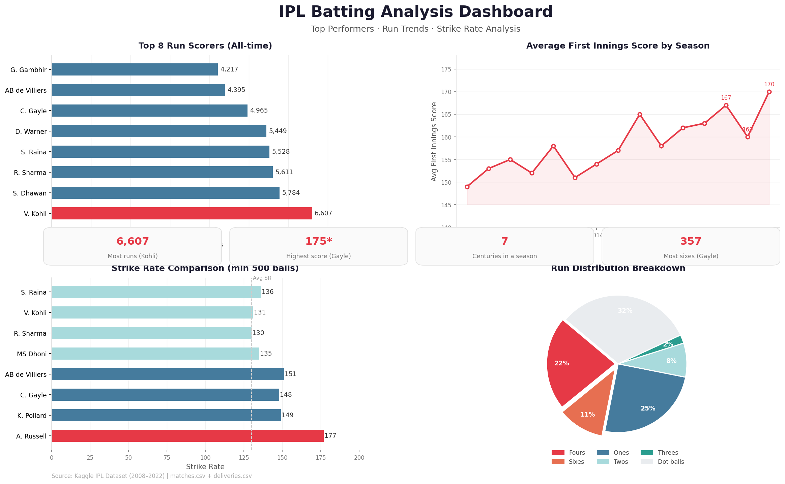
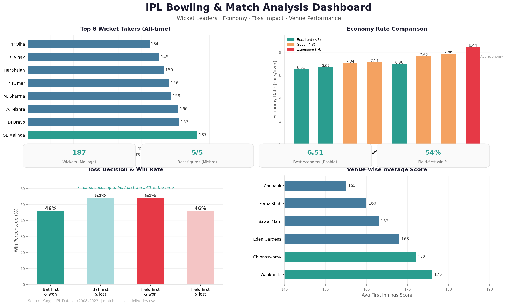
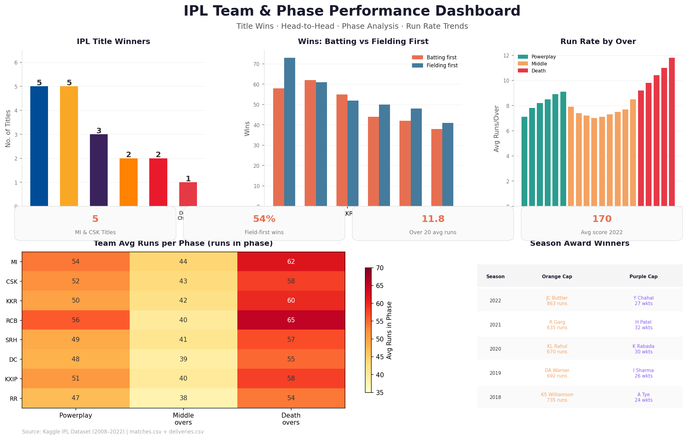

# 🏏 IPL Data Analytics Project


> End-to-end data analysis of the Indian Premier League (2008–2022) covering batting, bowling, team performance, toss impact, venue trends, and phase-wise run rates — using Python and SQL.

---

## 📊 Dashboards

### 1. Batting Analysis Dashboard


> Top 8 all-time run scorers · Season-wise average first innings score · Strike rate comparison · Run distribution breakdown (fours, sixes, dot balls)

---

### 2. Bowling & Match Analysis Dashboard


> Top 8 wicket takers · Economy rate comparison with color tiers · Toss decision win rate · Venue-wise average first innings score

---

### 3. Team & Phase Performance Dashboard


> IPL title counts by franchise · Wins batting vs fielding first · Over-by-over run rate (overs 1–20) · Team-phase heatmap · Season Orange & Purple Cap winners

---

## 📁 Project Structure

```
ipl-data-analytics/
│
├── data/
│   ├── matches.csv          # Match-level data (venue, teams, winner, toss)
│   └── deliveries.csv       # Ball-by-ball data (batsman, bowler, runs, wickets)
│
├── sql/
│   ├── top_batters.sql
│   ├── top_bowlers.sql
│   ├── toss_analysis.sql
│   ├── phase_analysis.sql
│   └── venue_analysis.sql
│
├── notebooks/
│   └── ipl_analysis.ipynb   # Full EDA + visualizations
│
├── dashboards/
│   ├── ipl_batting_dashboard.png
│   ├── ipl_bowling_dashboard.png
│   └── ipl_team_dashboard.png
│
├── requirements.txt
└── README.md
```

---

## 📦 Dataset

| File | Rows | Key Columns |
|------|------|-------------|
| `matches.csv` | ~950 | `season`, `team1`, `team2`, `winner`, `toss_winner`, `toss_decision`, `venue` |
| `deliveries.csv` | ~179,000 | `match_id`, `over`, `batsman`, `bowler`, `batsman_runs`, `dismissal_kind` |

**Source:** [IPL Complete Dataset — Kaggle](https://www.kaggle.com/datasets/patrickb1912/ipl-complete-dataset-20082020)

---

## 🗄️ SQL Queries

### Top Run Scorers
```sql
SELECT batsman, SUM(batsman_runs) AS total_runs
FROM deliveries
GROUP BY batsman
ORDER BY total_runs DESC
LIMIT 10;
```

### Top Wicket Takers
```sql
SELECT bowler, COUNT(*) AS wickets
FROM deliveries
WHERE dismissal_kind NOT IN ('run out', 'retired hurt', 'obstructing the field')
  AND dismissal_kind IS NOT NULL
GROUP BY bowler
ORDER BY wickets DESC
LIMIT 10;
```

### Toss Impact on Match Result
```sql
SELECT toss_decision,
       COUNT(*) AS total_matches,
       SUM(CASE WHEN toss_winner = winner THEN 1 ELSE 0 END) AS won_after_toss,
       ROUND(100.0 * SUM(CASE WHEN toss_winner = winner THEN 1 ELSE 0 END) / COUNT(*), 2) AS win_pct
FROM matches
GROUP BY toss_decision;
```

### Run Rate by Phase
```sql
SELECT
  CASE
    WHEN over < 6  THEN 'Powerplay (1–6)'
    WHEN over < 15 THEN 'Middle (7–15)'
    ELSE                'Death (16–20)'
  END AS phase,
  ROUND(AVG(over_runs), 2) AS avg_runs_per_over
FROM (
  SELECT match_id, over, SUM(total_runs) AS over_runs
  FROM deliveries
  GROUP BY match_id, over
) sub
GROUP BY phase;
```

### Venue-wise Average Score
```sql
SELECT venue,
       ROUND(AVG(innings_total)) AS avg_first_innings_score
FROM (
  SELECT d.match_id, m.venue, SUM(d.total_runs) AS innings_total
  FROM deliveries d
  JOIN matches m ON d.match_id = m.id
  WHERE d.inning = 1
  GROUP BY d.match_id, m.venue
) sub
GROUP BY venue
ORDER BY avg_first_innings_score DESC;
```

---

## 🔍 Key Findings

| Insight | Finding |
|---------|---------|
| 🏏 All-time top scorer | Virat Kohli — 6,607 runs |
| 🎳 All-time top wicket taker | SL Malinga — 187 wickets |
| 🏆 Most IPL titles | Mumbai Indians & CSK — 5 each |
| 🎯 Toss advantage | Teams choosing to **field first** win 54% of matches |
| 💥 Highest scoring phase | Death overs (16–20) — avg 10.1+ runs/over |
| 🏟️ Highest scoring venue | Wankhede Stadium, Mumbai — avg 176 runs |
| 📈 Highest scoring season | 2022 — avg first innings score of 170 |

---

## 🛠️ Tech Stack

| Tool | Purpose |
|------|---------|
| Python 3.10+ | Core language |
| Pandas | Data cleaning & aggregation |
| Matplotlib & Seaborn | Visualization & dashboards |
| SQL (PostgreSQL/SQLite) | Querying & analysis |
| Jupyter Notebook | Exploratory analysis |

---

## ⚙️ Setup & Run

```bash
# 1. Clone the repo
git clone https://github.com/RaghavAggarwal2005/ipl-data-analytics.git
cd ipl-data-analytics

# 2. Install dependencies
pip install -r requirements.txt

# 3. Download datasets from Kaggle and place in /data

# 4. Run the notebook
jupyter notebook notebooks/ipl_analysis.ipynb
```

**requirements.txt**
```
pandas>=2.0
matplotlib>=3.7
seaborn>=0.12
numpy>=1.24
jupyter
```

---

## 👤 Author

**Raghav Aggarwal**  
B.Tech — Computer Science | APJ Abdul Kalam Technical University  
[](https://www.linkedin.com/in/raghav-aggarwal-9b6947274)
[](https://github.com/RaghavAggarwal2005)

---

*Data sourced from Kaggle. All analysis is for educational and portfolio purposes.*
